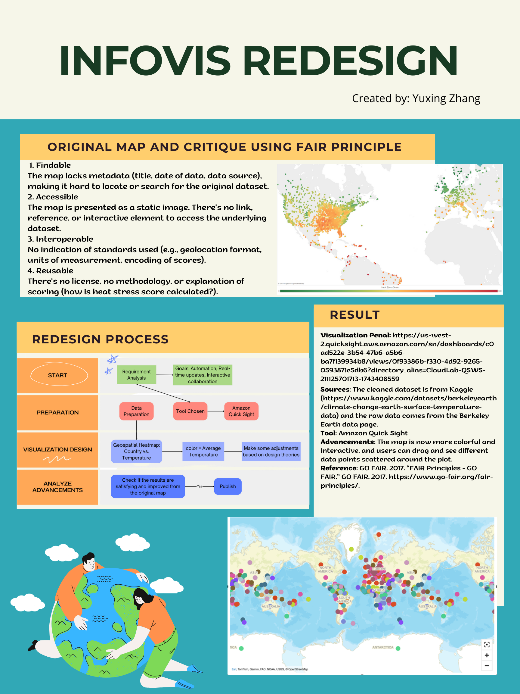

# 🌍 InfoVis Redesign Project: Global Temperature Map

## 📌 Project Overview
This project redesigns the static "Four Twenty Seven" heat stress map into an interactive global temperature visualization using R language, enabling users to explore historical land temperature data (1950-2024) through dynamic time sliders, region filters, and tooltip metrics. Built with R (ggplot2, leaflet, etc.) and base layers, the enhanced visualization improves upon the original by implementing color scales, time comparisons, and intuitive interactivity - transforming a limited static map into an informative analytical tool for climate risk assessment. 

## 📊 Dataset Information

- **Filename**: `GlobalLandTemperatureByCountry.csv`  
- **Source**: [Berkeley Earth via Kaggle](https://www.kaggle.com/datasets/berkeleyearth/climate-change-earth-surface-temperature-data)
- **Description**: 
- **Key columns**:
  - `dt`: Date  
  - `AverageTemperature`: Monthly average land temperature (in Celsius)  
  - `AverageTemperatureUncertainty`: Margin of error  
  - `Country`: Country name  

## 🛠️ Tools & Technologies

- embed flowchart
- describe how to replicate
