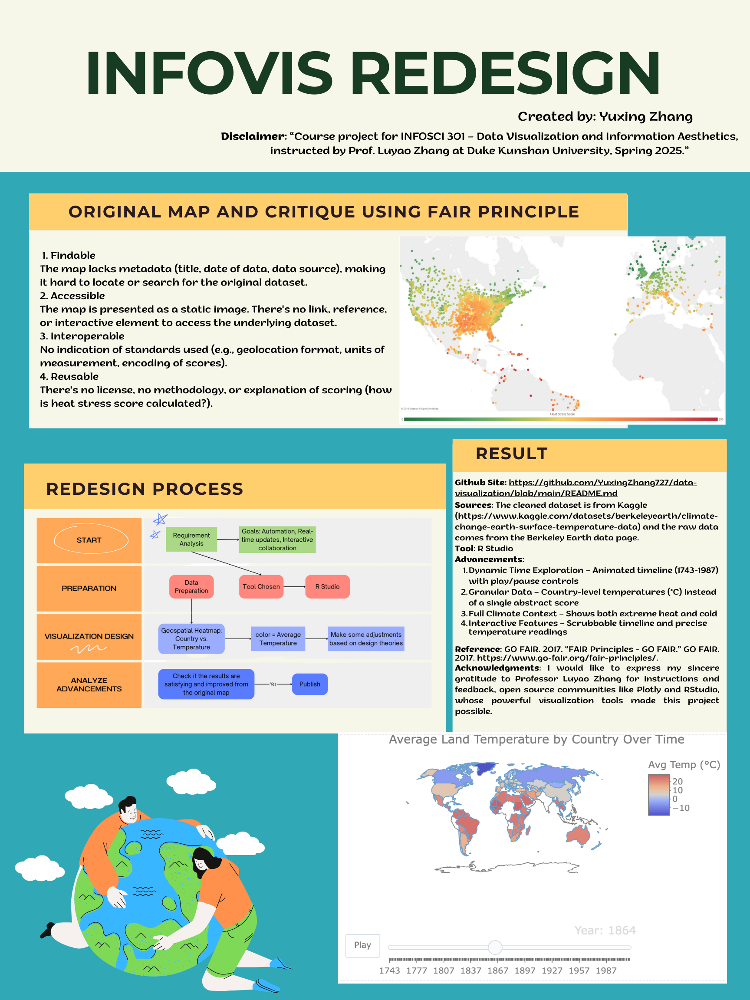

# 🌍 InfoVis Redesign Project: Global Temperature Map
## 📌 Project Overview
This project redesigns the static "Four Twenty Seven" heat stress map into an interactive global temperature visualization using R language, enabling users to explore historical land temperature data (1950-2024) through dynamic time sliders, region filters, and tooltip metrics. Built with R (ggplot2, leaflet, etc.) and base layers, the enhanced visualization improves upon the original by implementing color scales, time comparisons, and intuitive interactivity - transforming a limited static map into an informative analytical tool for climate risk assessment. 

## 📈Disclaimer
- This is the course project for INFOSCI 301 – Data Visualization and Information Aesthetics,
instructed by Prof. Luyao Zhang at Duke Kunshan University, Spring 2025.
## 🙏 Acknowledgments
- This project uses the Berkeley Earth Global Temperature dataset, and was inspired by the goal to make climate data more accessible and visually intuitive. Thanks to open data advocates and the R community for the tools and knowledge that made this possible. Also, I would like to express my sincere gratitude to Professor Luyao Zhang for instructions and feedback.

## 📊 Dataset Information
- **Filename**: `GlobalLandTemperatureByCountry.csv`  
- **Source**: [Berkeley Earth via Kaggle](https://www.kaggle.com/datasets/berkeleyearth/climate-change-earth-surface-temperature-data)
- **Description**: 
- **Key Variables**:
  | Column                       | Type      | Description                         |
  |-----------------------------|-----------|-------------------------------------|
  | `dt`                        | Date      | Measurement date (YYYY-MM-DD)       |
  | `AverageTemperature`        | Numeric   | Mean temperature in °C              |
  | `AverageTemperatureUncertainty` | Numeric   | 95% confidence interval         |
  | `Country`                   | Character | Country or territory name           |

## 🛠️ Tools & Technologies

- 
- How to replicate:
  - Download the Dataset
  - Prepare the environment(`install.packages(c("plotly", "dplyr", "lubridate", "ggplot2", "leaflet")`)
  - Follow the code provided
