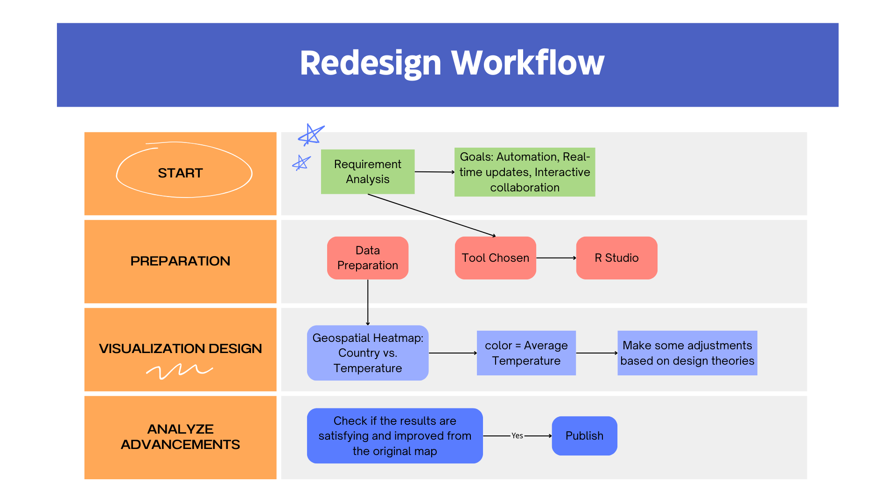

# 🌍 InfoVis Redesign Project: Global Temperature Map
## 📌 Project Overview
This project redesigns the static "Four Twenty Seven" heat stress map into an interactive global temperature visualization using R language, enabling users to explore historical land temperature data (1950-2024) through dynamic time sliders, region filters, and tooltip metrics. Built with R (ggplot2, leaflet, etc.) and base layers, the enhanced visualization improves upon the original by implementing color scales, time comparisons, and intuitive interactivity - transforming a limited static map into an informative analytical tool for climate risk assessment. 

## 📈Disclaimer
- This is the course project for INFOSCI 301 – Data Visualization and Information Aesthetics,
instructed by Prof. Luyao Zhang at Duke Kunshan University, Spring 2025.
## 🙏 Acknowledgments
- This project uses the Berkeley Earth Global Temperature dataset and was inspired by the goal of making climate data more accessible and visually intuitive. Thanks to open data advocates and the R community for the tools and knowledge that made this possible. I’m also grateful to Professor Luyao Zhang for her guidance, to my classmates for their valuable feedback, and to guest speakers David Schaaf and Dongping Liu for their insightful presentations on education technology and data application. This project has also benefitted from the conversations at the Digital Technology for Sustainability Symposium at Duke Kunshan University on April 18. We especially thank Prof. Ming-Chun Huang for his insights that helped improve the work, and the conference organizers for making the symposium happen.

## 📊 Dataset Information
- **Filename**: `GlobalLandTemperatureByCountry.csv`  
- **Source**: [Berkeley Earth via Kaggle](https://www.kaggle.com/datasets/berkeleyearth/climate-change-earth-surface-temperature-data)
- **Description**: 
- **Key Variables**:
  | Column                       | Type      | Description                         |
  |-----------------------------|-----------|-------------------------------------|
  | `dt`                        | Date      | Measurement date (YYYY-MM-DD)       |
  | `AverageTemperature`        | Numeric   | Mean temperature in °C              |
  | `AverageTemperatureUncertainty` | Numeric   | 95% confidence interval         |
  | `Country`                   | Character | Country or territory name           |

## 🛠️ Tools & Technologies

- 
- How to replicate:
  - Download the Dataset
  - Prepare the environment(`install.packages(c("plotly", "dplyr", "lubridate", "ggplot2", "leaflet")`)
  - Follow the code provided
 
## 🌤️ Contribution to SDG 13 – Climate Action 

The **Interactive Global Average Temperature Map** contributes to **SDG 13 – Climate Action** by visualizing data related to global temperature changes over time. Climate change is one of the most pressing challenges humanity faces, and understanding its trends is crucial for informing climate policies and individual actions. By offering an accessible way to explore temperature variations across different countries, this project aims to enhance public awareness, encourage sustainable practices, and inform decisions that will mitigate the effects of climate change.

### How This Project Supports Sustainability and Environmental Awareness:
- **Data-Driven Awareness:** The project uses publicly available climate data to demonstrate how temperature has changed over the years. Users can interactively explore this data, increasing their awareness of global climate patterns and the importance of taking action against global warming.
- **Sustainability:** By focusing on the global implications of climate change, the project reinforces the need for sustainable development and supports the transition to a low-carbon economy.
- **Community Engagement:** Through visualizing the temperature data, the project seeks to engage a broad audience in the conversation around climate action, motivating individuals and communities to adopt environmentally friendly practices.

## 🎨 Reflection from the Zhouzhuang Mystery of Life Museum Field Trip 

During our visit to the Zhouzhuang Mystery of Life Museum, we were able to experience firsthand how scientific storytelling and aesthetics can significantly impact our understanding of complex topics like climate change. The museum used visually engaging displays to simplify difficult concepts, making them more accessible and memorable for the public. This experience inspired me to incorporate interactive features and appealing visualizations into my project to enhance user engagement.

The museum's focus on **ethics** and **responsible storytelling** also encouraged me to ensure that my visualization communicates information transparently and responsibly. As I continue working on this project, I am mindful of how the visual representation of data can shape perceptions and inform decision-making, especially when it comes to critical global issues like climate change.

Moreover, the museum experience emphasized the importance of **digital humanities** and the power of storytelling in making science more relatable to the general public. In future iterations of this project, I aim to explore how digital technologies can further bridge the gap between scientific knowledge and public understanding, particularly in the context of **biodiversity** and **community-based learning**.

## 📚 Future Research Directions 

Looking forward, I see potential for expanding this project by integrating it with digital humanities initiatives and exploring its application in community-based learning. Specifically, future work could:
- Incorporate more detailed environmental data, such as biodiversity metrics, to visualize the impacts of temperature changes on ecosystems.
- Develop interactive features that allow users to explore not only temperature but also its relationship with biodiversity and other environmental indicators.
- Collaborate with local communities to create educational materials that tie the temperature data with regional climate action efforts, promoting sustainable practices and policy advocacy.

Additionally, this project could benefit from the integration of **virtual reality (VR)** or **augmented reality (AR)** to allow users to immerse themselves in climate change data, enhancing their connection to the content and encouraging more active participation in climate action.
